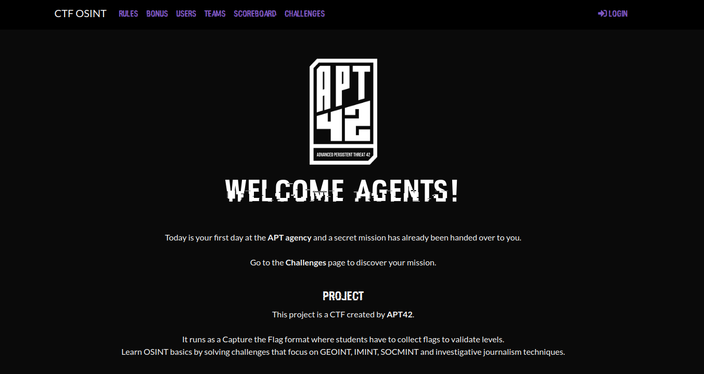

# APT42 CTFd themes

Themes we created for the CTFs organized by our student club.

Compatible with CTFd `v3.1.1`.

  

1. [Installation](#installation)
2. [Themes](#themes)
3. [Acknowledgements](#acknowledgements)
4. [Credits](#credits)

# Installation

Copy the theme folder to `/path/to/CTFd/themes/<theme_name>`. Then, in Admin Panel > Configuration > Theme, select the desired theme.

# Themes

1. [Watchdogs](watchdogs/README.md) (purple palette, Watchdogs font)
2. [ftheme](ftheme/README.md) (red palette)

# Acknowledgements

## Contributors

* avan-pra
* mboivin

## Many thanks to

* therbret
* wandre

# Credits

- [CTFd](https://github.com/CTFd/CTFd) (Logo by Laura Barbera, Theme by Christopher Thompson, Notification Sound by Terrence Martin), under [Apache License
Version 2.0](https://www.apache.org/licenses/LICENSE-2.0)

- [Hacked font](https://watchdogsfont.com/) by David Libeau, under [CC BY 4.0](https://creativecommons.org/licenses/by/4.0/)
