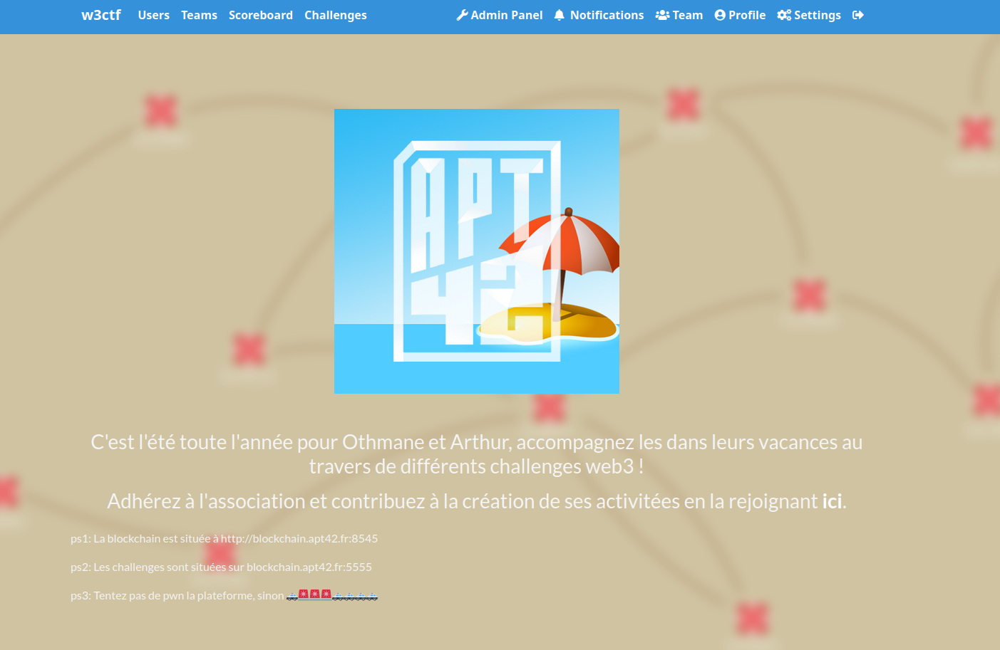
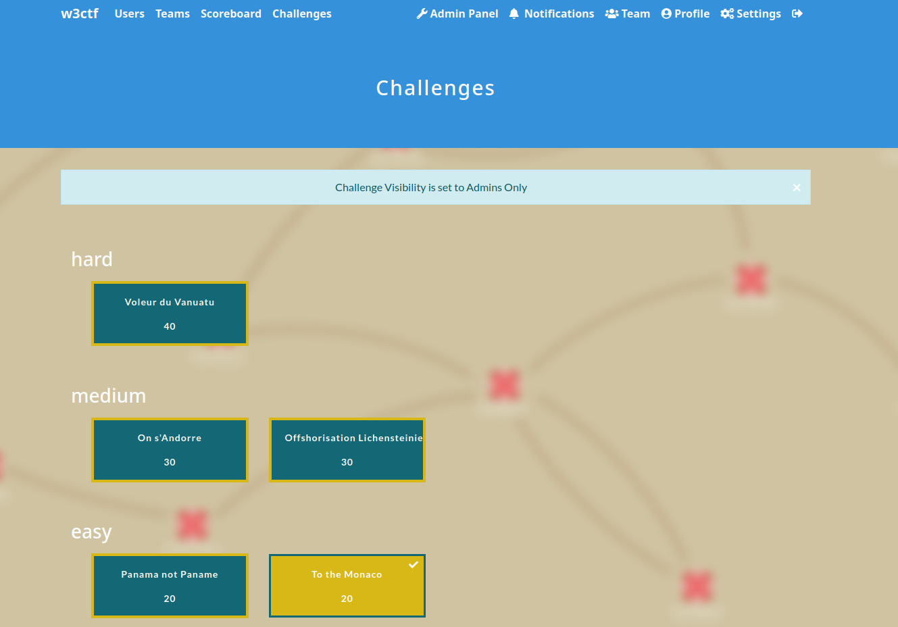

# w3theme

Theme we created for the CTFs organized by our student club.

Compatible with CTFd `v3.6.0`.

1. [Installation](#installation)
2. [Preview](#preview)
3. [Credits](#credits)

# Installation

Copy the theme folder to `/path/to/CTFd/themes/w3theme`. Then, in Admin Panel > Configuration > Theme, select `ftheme`.

# Preview

   

# Credits

- [CTFd](https://github.com/CTFd/CTFd) (Logo by Laura Barbera, Theme by Christopher Thompson, Notification Sound by Terrence Martin), under [Apache License
Version 2.0](https://www.apache.org/licenses/LICENSE-2.0)
